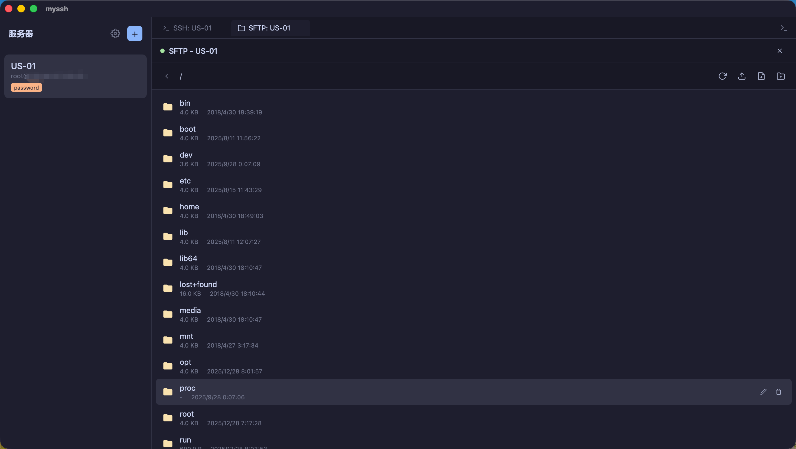
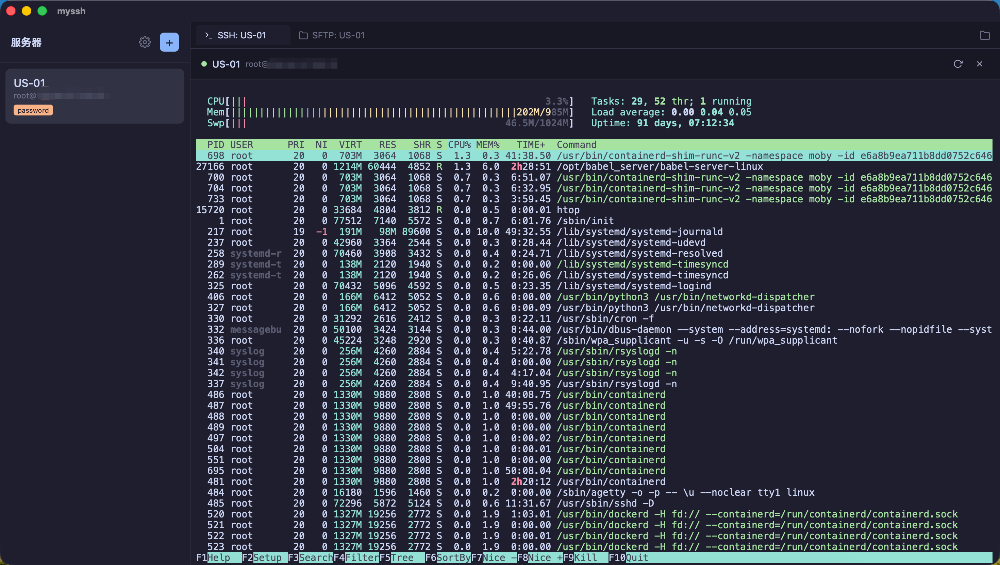

# MySSH

<p align="center">
  
</p>

<p align="center">
  A simple, open-source SSH client - Termius alternative
</p>

<p align="center">
  <strong>English</strong> | <a href="#中文">中文</a> | <a href="#日本語">日本語</a>
</p>

## Features

- **Server Management** - Add, edit, delete SSH server configurations
- **SSH Terminal** - Full-featured terminal with xterm.js
- **SFTP File Browser** - Browse, upload, download, edit remote files
- **Authentication** - Password and private key authentication
- **Proxy Support** - HTTP and SOCKS5 proxy connections
- **Secure Storage** - AES-256-GCM encrypted credential storage
- **Backup & Restore** - Export/import configurations with password protection
- **Multi-language** - English, Chinese (Simplified), Japanese
- **Cross-platform** - macOS, Windows, Linux

## Screenshots




## Installation

### Download

Download the latest release from [Releases](https://github.com/dollarkillerx/MySSH/releases).

### Build from Source

Prerequisites:
- [Node.js](https://nodejs.org/) 18+
- [pnpm](https://pnpm.io/)
- [Rust](https://www.rust-lang.org/) 1.70+

```bash
# Clone the repository
git clone https://github.com/dollarkillerx/MySSH.git
cd myssh

# Install dependencies
pnpm install

# Development
pnpm tauri dev

# Build
pnpm tauri build
```

## Tech Stack

- **Frontend**: Vue 3 + Vite + vue-i18n
- **Backend**: Rust + Tauri 2
- **Terminal**: xterm.js
- **SSH/SFTP**: russh + russh-sftp

## License

MIT License

---

<h2 id="中文">中文</h2>

一个简单的开源 SSH 客户端，Termius 替代品。

### 功能特性

- **服务器管理** - 添加、编辑、删除 SSH 服务器配置
- **SSH 终端** - 基于 xterm.js 的全功能终端
- **SFTP 文件浏览器** - 浏览、上传、下载、编辑远程文件
- **认证方式** - 支持密码和私钥认证
- **代理支持** - HTTP 和 SOCKS5 代理连接
- **安全存储** - AES-256-GCM 加密存储凭据
- **备份恢复** - 支持密码保护的配置导入/导出
- **多语言** - 中文、英文、日文
- **跨平台** - macOS、Windows、Linux

### 从源码构建

```bash
# 克隆仓库
git clone https://github.com/dollarkillerx/MySSH.git
cd myssh

# 安装依赖
pnpm install

# 开发模式
pnpm tauri dev

# 构建
pnpm tauri build
```

---

<h2 id="日本語">日本語</h2>

シンプルなオープンソース SSH クライアント - Termius の代替品

### 機能

- **サーバー管理** - SSH サーバー設定の追加、編集、削除
- **SSH ターミナル** - xterm.js ベースのフル機能ターミナル
- **SFTP ファイルブラウザ** - リモートファイルの閲覧、アップロード、ダウンロード、編集
- **認証** - パスワードと秘密鍵認証
- **プロキシ対応** - HTTP と SOCKS5 プロキシ接続
- **安全なストレージ** - AES-256-GCM 暗号化による認証情報の保存
- **バックアップ** - パスワード保護付きの設定エクスポート/インポート
- **多言語対応** - 日本語、英語、中国語
- **クロスプラットフォーム** - macOS、Windows、Linux

### ソースからビルド

```bash
# リポジトリをクローン
git clone https://github.com/dollarkillerx/MySSH.git
cd myssh

# 依存関係をインストール
pnpm install

# 開発モード
pnpm tauri dev

# ビルド
pnpm tauri build
```
